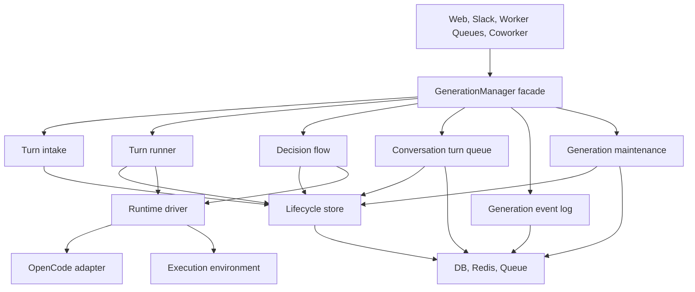

# Proposal Two: Deep Lifecycle Store and Runtime Driver

This proposal replaces `packages/core/src/server/services/generation-manager.ts`
with a small product facade and a few deep modules. It starts from
`proposal-one`, but addresses the review feedback by reducing overlapping
interfaces and making the lifecycle/store and runtime driver own the hard parts.

The target is a Big Bang internal rewrite of `generation-manager.ts`, not an
incremental wrapper stack around the current class. The exported
`generationManager` product facade can keep the existing caller-facing method
names during the cutover, but the internals should be replaced directly.

## Current Design Pressure

`generation-manager.ts` is 10k+ lines because it combines several independent
forms of knowledge:

- turn intake: conversation setup, model/auth checks, messages, attachments,
  coworker metadata, execution policy, runtime binding, and queueing
- lifecycle persistence: generation status, conversation status, coworker run
  status, interrupts, terminal messages, usage counters, billing, push
  notification, queued-message continuation
- runtime protocol: OpenCode events, cumulative text deltas, tool state,
  permissions, questions, idle detection, prompt result fallback, session export,
  reattach, usage capture
- decision flow: plugin writes, runtime permissions, runtime questions, auth,
  expiry, parking, resume, and applying decisions back to runtime
- execution environment: sandbox acquisition, slot leases, restore, pre-prompt
  preparation, uploads, runtime context/env writes, snapshots, teardown
- event log: Redis stream publication, cursor replay, DB recovery, terminal
  recovery events, coworker event mirroring
- maintenance: preparing stuck checks, generation timeout jobs, stale reaper,
  queue self-heal

The main problem is not that these concerns are in one file. The deeper problem
is information leakage: lifecycle state is written from many paths, OpenCode
protocol knowledge leaks into product state transitions, and decision handling
is split across approval, auth, runtime question, and plugin write flows.

## Chosen Module Shape

```text
generation/
  generation-manager.ts          # public product facade, mostly compatibility surface
  turn-intake.ts                 # create or continue a user-visible turn
  turn-runner.ts                 # claim a turn and drive runtime events into product outcomes

  core/
    lifecycle-store.ts           # transactional owner of product state
    turn-record.ts               # narrow turn snapshots and transition result types

  decisions/
    decision-flow.ts             # request, resolve, expire, resume, apply
    decision-types.ts

  queue/
    conversation-turn-queue.ts   # queued user messages for idle conversations

  streams/
    generation-event-log.ts      # publish, subscribe, replay, terminal fallback

  maintenance/
    generation-maintenance.ts    # timeout, stuck, stale, self-heal jobs

runtime/
  runtime-driver.ts              # provider-neutral runtime seam
  opencode/
    opencode-runtime-driver.ts   # OpenCode adapter
    opencode-event-translator.ts # cumulative delta/tool/permission/question logic
    opencode-reattach.ts         # restore, observe, idle/error reconciliation

execution/
  execution-environment.ts       # provider-neutral execution seam
  execution-environment-factory.ts
  providers/
    docker-environment.ts
    daytona-environment.ts
    e2b-environment.ts
```

This shape has six generation modules that matter:

- public product facade
- turn intake
- turn runner
- lifecycle store
- decision flow
- event log

Queue and maintenance are separate because they have different callers and can
be tested without runtime execution. Runtime and execution environment are
separate because OpenCode is not a sandbox provider and sandbox providers are
not agent engines.

## Ownership Rules

### Lifecycle Store Owns Product Transitions

The lifecycle store is the strictest module. It owns the database writes and
product side effects for turn transitions. Other modules call lifecycle methods
such as:

- `createRunningTurn`
- `claimTurnForRun`
- `markAwaitingDecision`
- `markPausedForDeadline`
- `resumeAfterDecision`
- `requestCancellation`
- `appendProgress`
- `finishTurn`
- `finishDetachedTurn`

The important design move is that these methods persist the full product
transition. They do not merely return update objects for callers to save.

For example, `finishTurn` owns:

- cancelling pending interrupts
- persisting the assistant message when needed
- linking generated sandbox files
- updating `generation`
- updating `conversation` and usage counters
- clearing the active runtime generation
- saving the session snapshot when appropriate
- tracking billing
- updating `coworkerRun`
- enqueueing the next queued conversation message
- returning the terminal event that the event log should publish

This is intentionally deeper than `GenerationTurnState` from proposal one. A
pure state calculator would still force callers to know which rows and side
effects belong to each transition.

### Runtime Driver Owns OpenCode Shape

The runtime driver must hide OpenCode protocol details. The generation turn
runner should not know about:

- `message.part.updated`
- `session.idle`
- cumulative text update semantics
- OpenCode tool part IDs versus call IDs
- permission request event shapes
- question answer command construction
- prompt result fallbacks
- session export payload shape
- status polling after early stream end

Those belong inside the OpenCode adapter. The adapter yields normalized
`RuntimeTurnEvent` values and exposes explicit operations for reattach, abort,
usage capture, and decision application.

If OpenCode-specific behavior still appears in `generation/turn-runner.ts`, the
runtime driver seam is too thin.

### Decision Flow Owns Interrupts

There should be one decision module, not separate approval, auth, runtime
question, plugin write, and interrupt modules with overlapping ownership.

Decision flow owns:

- request idempotency by provider request id
- auto-approval policy
- pending interrupt persistence
- expiry refresh when a hot wait becomes parked
- resolving approval, question, plugin write, and auth decisions
- projecting resolved decisions into content parts
- deciding whether a detached turn should be resumed
- applying resolved OpenCode decisions to a live runtime
- executing approved parked plugin writes before continuation

Decision flow calls the lifecycle store for status changes. It does not update
generation/conversation/coworker rows directly.

### Event Log Owns Stream Recovery

The event log owns Redis stream envelopes, cursor replay, DB fallback, terminal
recovery events, stream counters, duplicate subscriptions, and coworker run
event mirroring.

Runtime event translation creates product events, but publication and replay
belong here. Lifecycle store returns terminal event payloads; event log decides
how they are sequenced and replayed.

### Turn Intake Is Not Start-Turn

`startGeneration` is not just a lifecycle transition. It is a product intake
workflow. Keeping this as a deeper module avoids creating a large
`start-turn.ts` that still knows everything.

Turn intake owns:

- active generation guard and paused-run continuation checks
- conversation create/load and access validation
- model/auth source validation
- model access check
- user message persistence
- user attachment persistence
- coworker builder metadata first-prompt update
- coworker run conversation creation
- selected platform skill resolution
- execution policy construction
- generation creation through lifecycle store
- runtime binding
- queueing the first run job

## Dependency Direction



The lifecycle store sits below generation product modules because it hides the
persistence and side effects they currently duplicate. Runtime does not depend
on generation product modules except through callback-free data structures and
normalized events.

## How Current Methods Map

| Current method or cluster | New owner |
| --- | --- |
| `startGeneration`, `startCoworkerGeneration` | `turn-intake.ts` |
| `runQueuedGeneration`, `runGeneration` | `turn-runner.ts` |
| `runOpenCodeGeneration`, `processOpencodeEvent`, prompt fallback, usage capture | `runtime/opencode/*` |
| `runRecoveryReattach`, OpenCode export/session restore/idle reconciliation | `runtime/opencode/opencode-reattach.ts` |
| `submitApproval`, `submitApprovalByInterrupt` | `decisions/decision-flow.ts` |
| `submitAuthResult`, `submitAuthResultByInterrupt` | `decisions/decision-flow.ts` |
| `waitForApproval`, `requestPluginApproval`, `getPluginApprovalStatus` | `decisions/decision-flow.ts` |
| `waitForAuth`, `requestAuthInterrupt` | `decisions/decision-flow.ts` |
| `parkGenerationForInterrupt`, `suspendGenerationForInterrupt` | `decision-flow.ts` plus `lifecycle-store.ts` |
| `parkGenerationForRunDeadline` | `turn-runner.ts` plus `lifecycle-store.ts` |
| `finishGeneration`, `finalizeDetachedGenerationError` | `lifecycle-store.ts` |
| `subscribeToGeneration`, replay helpers, terminal recovery event helpers | `streams/generation-event-log.ts` |
| `broadcast`, `publishDetachedGenerationStreamEvent`, coworker mirroring | `streams/generation-event-log.ts` |
| `enqueueConversationMessage`, list/update/remove/process | `queue/conversation-turn-queue.ts` |
| lease acquisition/renew/release | `turn-runner.ts` or a private `generation-lease.ts` if reused |
| sandbox slot lease | execution environment factory or runner-local helper |
| `processGenerationTimeout`, `processPreparingStuckCheck`, `reapStaleGenerations`, self-heal | `maintenance/generation-maintenance.ts` |

## File Inventory And Size Estimate

These are planning estimates, not line-count targets. The point is to keep
large behavior behind deep modules while avoiding a second 10k-line manager.
The upper bound should trigger a design check: if a file grows beyond its band,
it may be absorbing a second ownership area or exposing too much interface
complexity.

| Target file | Estimated LOC |
| --- | ---: |
| `generation/generation-manager.ts` | 250-400 |
| `generation/turn-intake.ts` | 900-1,400 |
| `generation/turn-runner.ts` | 1,200-1,800 |
| `generation/core/lifecycle-store.ts` | 1,000-1,600 |
| `generation/core/turn-record.ts` | 150-300 |
| `generation/decisions/decision-flow.ts` | 900-1,400 |
| `generation/decisions/decision-types.ts` | 150-300 |
| `generation/queue/conversation-turn-queue.ts` | 400-700 |
| `generation/streams/generation-event-log.ts` | 600-1,000 |
| `generation/maintenance/generation-maintenance.ts` | 500-900 |
| `runtime/runtime-driver.ts` | 150-250 |
| `runtime/opencode/opencode-runtime-driver.ts` | 900-1,500 |
| `runtime/opencode/opencode-event-translator.ts` | 500-900 |
| `runtime/opencode/opencode-reattach.ts` | 500-900 |
| `execution/execution-environment.ts` | 120-220 |
| `execution/execution-environment-factory.ts` | 300-600 |
| `execution/providers/docker-environment.ts` | 250-500 |
| `execution/providers/daytona-environment.ts` | 300-600 |
| `execution/providers/e2b-environment.ts` | 250-500 |

Expected production total: roughly 9k-14k LOC. This may be close to the
current manager in total size, but the refactor should improve locality: common
changes should land in one deep module instead of requiring edits across
runtime protocol handling, product lifecycle writes, queueing, streaming, and
sandbox management.

## Interface Sketches

The files under `interfaces/` are sketches for the target seams. They are not
intended to compile in place. They are intentionally fewer than proposal one:

- `product-facade.ts`
- `lifecycle-store.ts`
- `decision-flow.ts`
- `runtime-driver.ts`
- `execution-environment.ts`
- `event-log.ts`

There is no separate `GenerationLifecycle`, `GenerationTurnState`,
`GenerationTurnStore`, `GenerationEventSink`, and `GenerationEventStream`.
Those names split one ownership area into shallow modules. `LifecycleStore`
and `GenerationEventLog` are the deeper modules.

## Implementation Order

1. Add tests around today’s behavior before the rewrite:
   - completed turn persists assistant message, usage, conversation status,
     terminal stream event, billing intent, coworker run update
   - approval/auth/question/plugin decisions move a turn into waiting state,
     expire correctly, and resume detached turns correctly
   - OpenCode cumulative text and reasoning updates emit deltas and persist full
     content for replay
   - stream subscription recovers from DB when Redis has no events
   - run deadline parks, snapshots, resumes, and preserves remaining budget

2. Build `LifecycleStore` first and move all direct product transition writes
   behind it. This is the main locality win.

3. Build `GenerationEventLog` and move stream publication, replay, terminal
   recovery, counters, and coworker mirroring behind it.

4. Build `DecisionFlow` and route approval, auth, runtime question, and plugin
   write paths through one request/resolve/expire/apply lifecycle.

5. Build the OpenCode runtime driver. Move protocol translation before moving
   the runner so `turn-runner.ts` can remain provider-neutral.

6. Replace the manager internals with `TurnIntake`, `TurnRunner`, queue, and
   maintenance modules. Keep the facade thin and delete old helpers rather than
   preserving fallback paths.

## Non-Goals

- Do not create one module per public method.
- Do not preserve OpenCode event names in generation modules.
- Do not introduce both state calculators and stores for lifecycle. The store
  owns persistence and transition side effects.
- Do not split approval, auth, question, and plugin write into separate
  lifecycle owners.
- Do not make execution environments understand generation statuses or product
  reasons for parking.

## Design Checks

Use these checks during implementation:

- Deletion test: deleting `LifecycleStore` should force transition complexity
  to reappear across intake, runner, decisions, maintenance, and queue.
- Runtime leakage check: no generation module switches on OpenCode event names.
- Decision locality check: adding another external decision kind changes
  `DecisionFlow` and type definitions, not runner, intake, and maintenance.
- Terminal transition check: every completed/cancelled/error path goes through
  one lifecycle method.
- Replay check: every user-visible event is either in the event log or
  reconstructable by the event log from DB snapshots.
